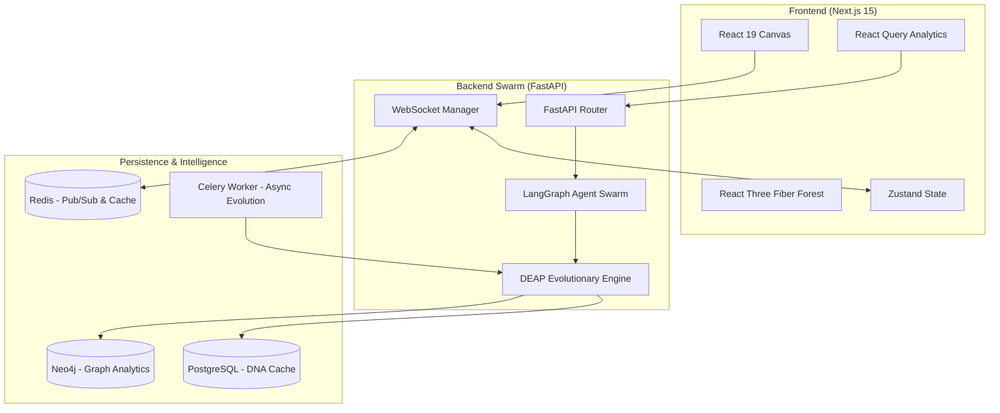

# 🌌 AetherWeave: Sentient 3D Architecture Loom

AetherWeave is a real-time, 3D living architecture loom that evolves structural designs through a multi-objective NSGA-II evolutionary engine, guided by a sentient LangGraph multi-agent swarm (Architect, Critic, Futurist, and Debater).


## 🏗️ System Architecture

AetherWeave employs a **Cyber-Organic Mesh** architecture, synchronising a distributed multi-agent swarm with a high-performance 3D neural forest.



## ✨ Key Features

- **Sentient Swarm Intelligence**: A 4-agent committee (Architect, Critic, Futurist, Debater) performs real-time architectural debate to guide the mutation of the loom.
- **3D Neural Forest**: A GPU-accelerated R3F scene rendering icosahedron nodes and adaptive edge-beams with real-time mutation shaders.
- **NSGA-II Multi-Objective Evolution**: Simultaneously optimises for **Scalability**, **Cost Efficiency**, and **Future-Proofing** across generations.
- **Neo4j Graph Analytics**: Real-time structural analysis (Bottlenecks, Clusters, S.P.O.F, and Critical Paths).
- **Symbiosis DNA Sharing**: Generate one-time QR codes to share structural genes between separate AetherWeave instances.

## 🚀 Quickstart (Production)

To launch the full 7-service stack using Docker Compose:

```bash
# Clone and spin up
git clone https://github.com/aetherweave/loom.git
cd loom
docker-compose up -d --build
```

### Services Map:
- **Loom UI**: [http://localhost:3000](http://localhost:3000)
- **API Reference**: [http://localhost:8000/docs](http://localhost:8000/docs)
- **Graph Browser**: [http://localhost:7474](http://localhost:7474) (Neo4j)
- **Redis Stats**: [http://localhost:6379](http://localhost:6379)

## 🧠 Technical Stack

- **Core**: TypeScript (Strict), Python 3.12 (Pydantic v2)
- **3D Engine**: Three.js, React Three Fiber, Framer Motion
- **AI/Evolution**: LangGraph, DEAP, NetworkX, NumPy
- **Infrastructure**: Redis (Pub/Sub), Celery (Beat), PostgreSQL (SQLAlchemy 2.0), Neo4j (Cypher)

---

> [!IMPORTANT]
> AetherWeave is a sentient system. Every generation of architecture is the result of thousands of autonomous agentic decisions. Observe the forest, feel the pulse.
